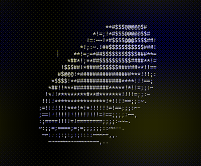

# Spinning Donut in C++

## Overview
This project creates a **spinning ASCII donut** rendered directly in the terminal. Using simple mathematical formulas for 3D rotation and projection, the program simulates a dynamic, spinning torus (donut) with ASCII characters for visual representation.

## Reflections
Learning math about how the code works was very interesting learning about the euclidian math involved
Also, this was a fun exercise to do over the weekend as I saw a friend talk about a YouTube video and I decided to attempt doing it also far more challenging for me due to the math involved and learning how to clean the screen every time
My initial runs were so choppy it gave me a headache

## Result

## V2

